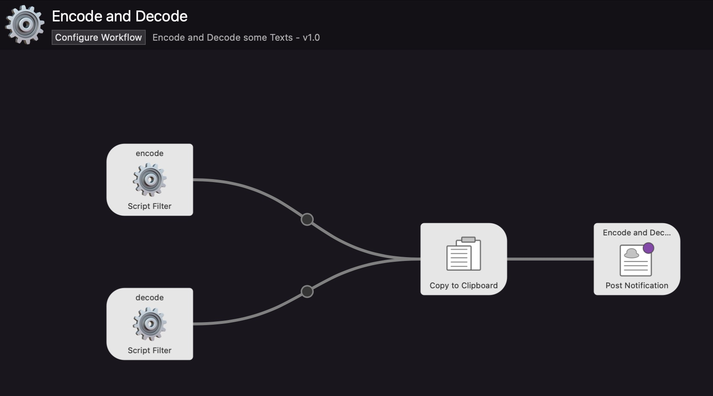
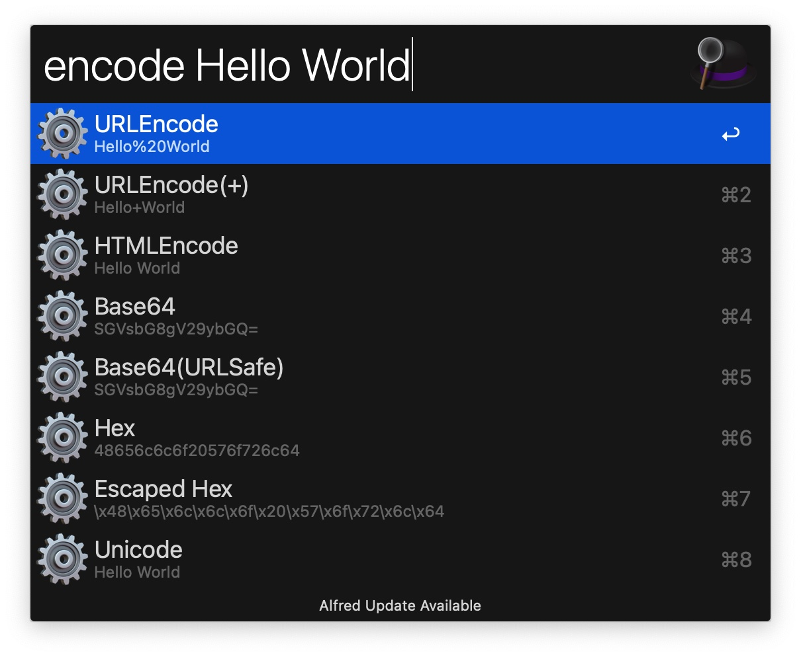

# Encode and Decode for Alfred

Alfred Workflow to encode and decode a string into multiple variations.

Supports:
- URL Encoding/Decoding
- HTML Encoding/Decoding
- Base64 Encoding/Decoding
- HEX Encoding/Decoding
- Unicode Encoding/Decoding

## Requirements

- [Alfred App](http://www.alfredapp.com/#download)
- [Alfred Powerpack](https://www.alfredapp.com/shop/)
- [Python3](https://www.python.org/downloads/)

## Installing

1. Download [encode-and-decode.alfredworkflow](https://github.com/zhaoyibo/alfred-encode-decode/releases/latest/download/encode-and-decode.alfredworkflow)
2. Double-click to import into Alfred
3. Review the workflow to add custom Hotkeys

## Commands

- `encode {query}` - Encode magic
- `decode {query}` - Decode magic

## Preview

- Encode

- Decode

## Thanks
 
 * [alfred-workflow-py3](https://github.com/NorthIsUp/alfred-workflow-py3)
